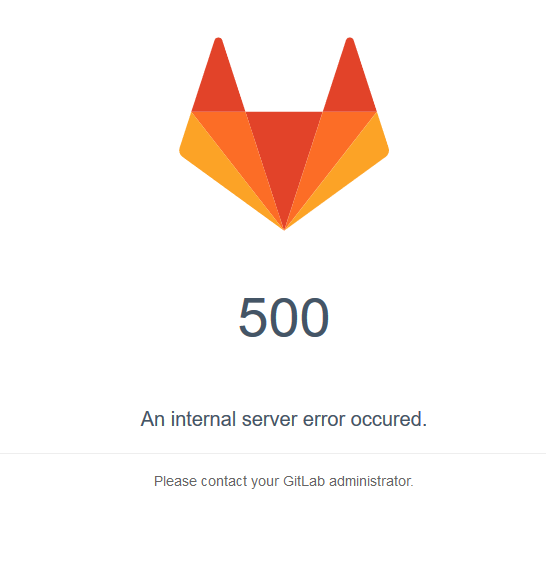
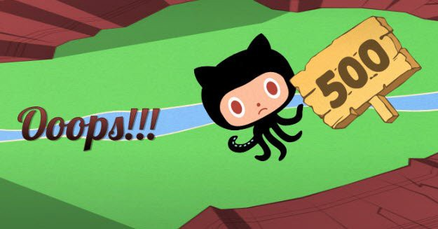

# Ospin Front-End Code Challenge

We are excited to be taking the next steps with you as a candidate! Our team has prepared a straight forward code challenge for you to complete. We value your time, and while you are free to spend as much time on the challenge as you wish, we have designed this to be completed _within two hours_.

---

## Overview

Provided is a simplified version of an old OSPIN React application. The application features a sidebar which uses React Router to navigate, and is complete with several views and a whole bunch of classic 20th century art. Also provided is a minimal testing set up, which should be all green when starting out.

As we expect to rapidly grow this application within the mean extreme programming machine that the OSPIN webdev team is, we want to make sure we have some sort of graceful error handling page for our clients when we goof up. After all, when you are in the middle of growing a new liver with a bioprocessing device controlled by a web app, you can't just have a blank screen show up if you encounter an error!

We would like to provide our users with an experience similar to these pages:

  

  

---

## Getting Started

- Please clone the repository - **do not fork!** This is to ensure your submission stays private. If you will be hosting the repo on Github or Gitlab (not mandetory, see FAQ), please rename the repository.
- Please run `npm i && npm test` followed by `npm start` to make sure everything is working as expected!

---

## Deliverables

- **When an uncaught error is thrown within any `render` function of a component:**
  - the sidebar should still be visible, and only the 'main-content' should be replaced with the error view
  - the url should reflect that a user is on the new error page
  - the user should be able to navigate away from the error page using the sidebar (the error page should only take up the 'main-content' window of the application)
  - the error view should display
  - we want to report the client side error to our backend, so make use of the existing method in the `ServerAPI` class to simulate the relevant information being sent in a POST request. Simply calling the provided method is sufficient!
  - the user should be able to successfully 'navigate back' in their browsers (by clicking the back button, hitting backspace, etc.)
  - **Test coverage should be provided for this new feature!**
  - **bonus:** provide the user with the option to see the actual error and the stack trace on the error page
  - **bonus:** provide additional thoughts in this README (space provided below) of how the dev team could best make use of the errors that are being reported to the backend!

---

## FAQ

**Q**: What do I do once I am finished?
**A**: **Please do not make a PR to the repo.** If you are able to host it on a Github account simply rename the repo, provide a link and it will be cloned. If you made your repo private, please invite github user `ospin-webapp` as a collaborator, let us know when you are finished, and it will be cloned. Otherwise, send an email to webdev.ospin@gmail.com either with your finished repo zipped and attached, or with a link to somewhere it can be downloaded.

**Q:** Re: the user experience, do I have to provide some fancy animations/etc. on the error page?
**A:** No! All you need to provide is what you consider a simple and polished view. There are some assets in `src/images` which you are welcome to use, but not required to. Feel free to be goofy with it!

**Q:** May I use dependencies not currently listed?
**A:** Of course! Please use whatever dependencies you see fit. While we have provided a test framework in the challenge, it is by no means necessary to use the same one.

**Q:** May I change the way existing code works?
**A:** Certainly - feel free to edit the repository as you see fit. Keep in mind that your work should reflect how you would go about solving this issue on a real team, and we will value the quality/precision of the git history when reviewing.

**Q:** Will you be reviewing Git history?
**A:** Yes! Please provide a structured and readable Git history. This should mimic a real feature + PR completion, and will be read as such.

**Q:** How much test coverage do I need to provide?
**A:** Use your best judgement depending on your time constraints. If it is a choice between 20 tests which cover 50% of the feature, vs. 5 tests which cover 95% of the feature, go for the higher coverage!

**Q:** What if I have additional questions about the feature/user experience?
**A:** First and foremost, if it is not blocking to your completion of the code challenge, feel free to list any assumptions you need to make in the discussion section of the README below. Otherwise, reach out directly if you have any questions that feel are blocking to the completion of this code challenge.

---

## Discussion

# Summary

This PR implements error catching within the app's main content via the use of a custom error boundary component. The error boundary redirects to a custom 500 error page.

Existing code has not been modified, except for a fix of incorrect function names and exports.

Testing coverage is provided.

The error handling sends error information to the backend via the reportError function in the ServerAPI class. The type error, error stack, and date of occurrence are all relayed.

As it was not stated in which format the database stores the current time, I chose a simple Date object. Specific formats can be implemented if desired, let me know!

# Suggestion for the Backend

I would suggest building a function that extracts the place in which the error occured from the error stack object to pinpoint potentially problematic areas within the code.

# Feedback on the Challenge

The instructions were precise and easy to follow (I can tell from comparison that you're doing very well here :D).
In my implementation, the 'go back' link takes the user back to the page before the error occurred. The back button has default behavior.

Thanks!
